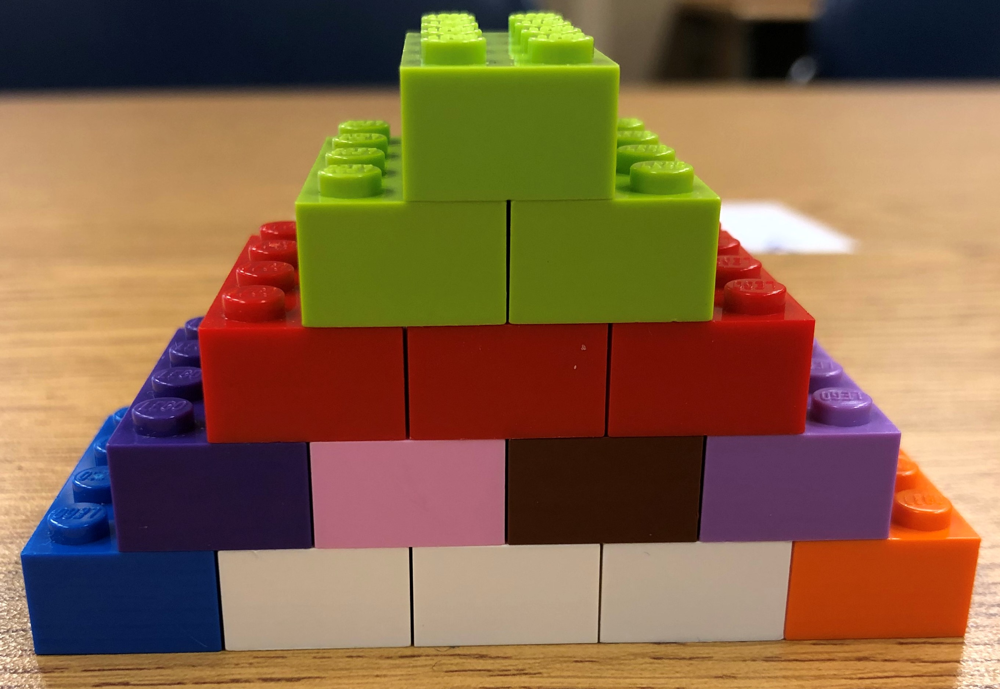
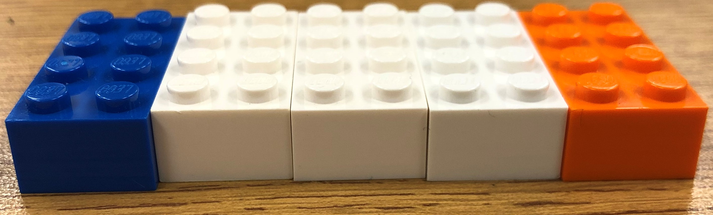
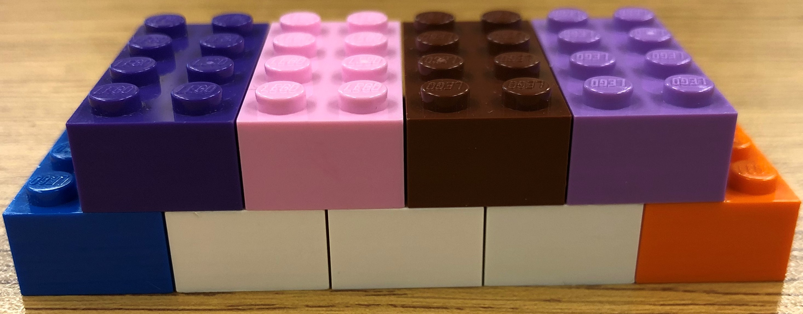
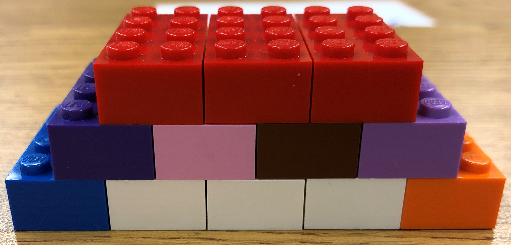
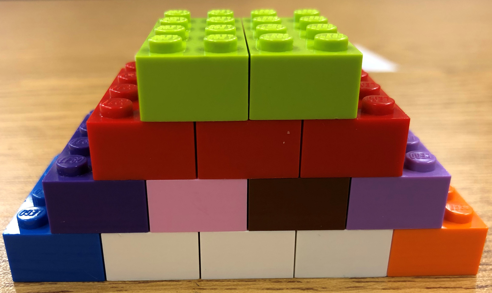
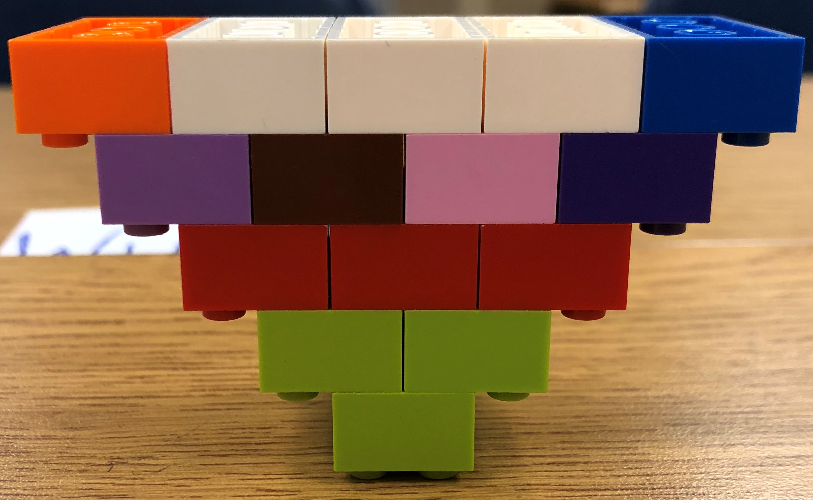

# Upside Down Lego Pyramid in 6 Easy Steps
### Instructions by: William Jackson
##### Materials needed: 2x4 Lego Pieces x 15

### Step 1: Create the Foundation
##### Materials needed: Five 2x4 Lego Bricks (blue, white x 3, orange)
- From left to right, on a level surface, lay down 5 Lego pieces so that the long sides are touching one another.
 - From left to right, color coded as follows: blue, white x 3, orange.
- Ensure that the front and rear edges are flush with one another. 

### Step 2: Create Second Level
##### Materials needed: Four 2x4 Lego Bricks (light purple, brown, pink, purple)
- From left to right, place the first Lego (purple) halfway on the orange and white Lego pieces beneath it.
- From left to right, place the remaining Legos so that the long sides are touching one another.
 - From left to right, color coded as follows: brown, pink, light purple
- Ensure that the front and rear edges are flush with one another
- Ensure that the orange and blue Lego pieces on the first level have one row exposed.

### Step 3: Create Third Level
##### Materials needed: Three 2x4 Lego Bricks (red)
- From left to right, place the first Lego halfway on the light purple and brown Lego pieces beneath it.
- From left to right, place the remaining Legos so that the long sides are touching one another.
- Ensure that the front and rear edges are flush with one another.
- Ensure that the light purple and purple Lego pieces on the second level have one row exposed.

### Step 4: Create Fourth Level
##### Materials needed: Two 2x4 Lego Bricks (green)
- From left to right, place the first Lego halfway on the red Lego pieces beneath it.
- From left to right, place the remaining Lego piece so that the long sides are touching one another.
- Ensure that the front and rear edges are flush with one another.
- Ensure that the outside red Lego pieces on the third level have one row exposed.

### Step 5: Create Fifth Level
##### Materials needed: One 2x4 Lego Bricks (green)
- Place the green Lego piece so that it sits directly halfway between both green Lego pieces beneath it.
- Ensure that the front and rear edges are flush with one another.
- Ensure that the green Lego pieces on the fourth level have one row exposed.

### Step 6: Invert the Pyramid
- Grab the Lego pyramid and flip it so that it is sitting on the single green piece and the five-piece foundation is now the top.

